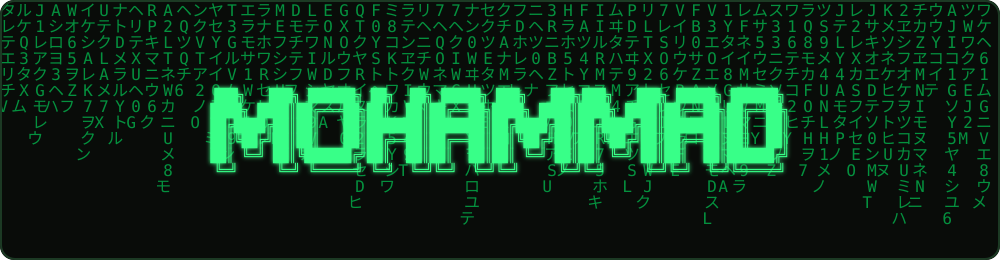
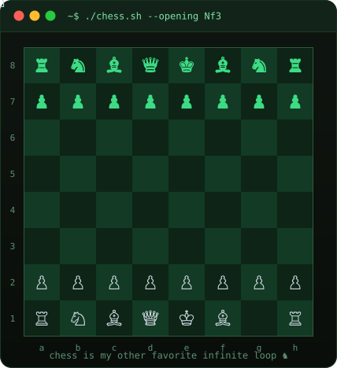

 

---

### 🧑‍💻 About Me

- 🎓 Computer Science undergrad, always building side projects
- 🛠️ Working with **C#**, **PHP**, **JavaScript / Node.js**
- ☁️ Comfortable with **Cloudflare Workers**, serverless architecture, and API design
- ♞ Chess player — I treat debugging like an endgame, always looking a few moves ahead
- 📈 Constantly expanding my stack and shipping small useful tools

---

### 🧰 Tech Stack

  

---

### ♟️ Also, I Play Chess

  

---

### 📊 GitHub Stats

  
  

  

---

### 🐍 Contribution Snake

  

---

### 🌐 Connect with me

  
  

---

